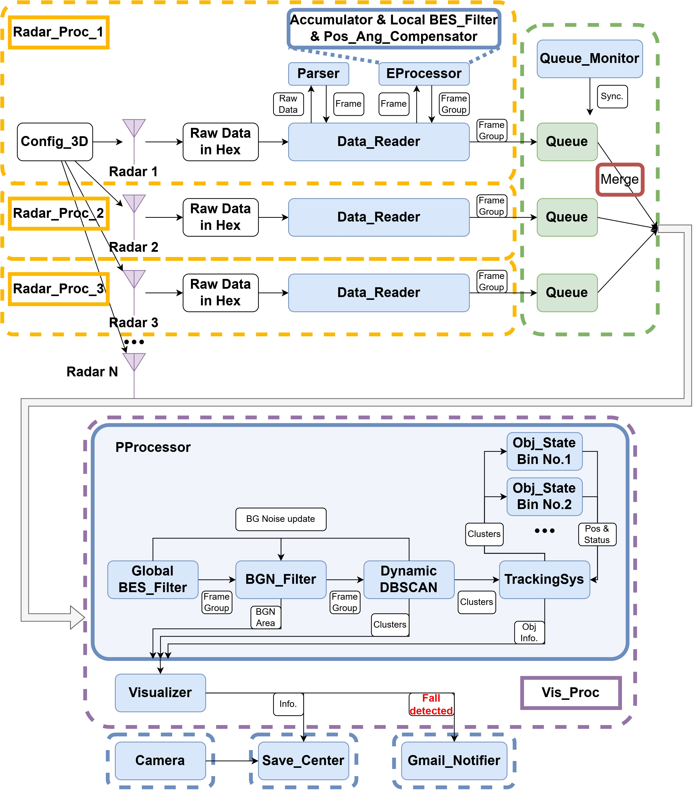

# Millimeter-Wave Radar-Based Multi-Human Tracking and Fall Detection System

## Overview
This repository contains the implementation and code resources for our paper: **Advanced Millimeter-Wave Radar System for Real-Time Multiple-Human Tracking and Fall Detection** (link: https://doi.org/10.3390/s24113660). The study explores an indoor system that employs Millimeter-Wave radars to track multiple humans and detect falls in real time. By integrating signals from non-intrusive radars, our framework addresses challenges such as mobility inconvenience, lighting conditions, and privacy issues inherent in wearable or camera-based systems.

### Key Features
- **Multi-Human Tracking**: Tracks multiple humans simultaneously with high precision.
- **Real-Time Fall Detection**: Accurately predicts and classifies human body statuses, including falls.
- **Advanced Signal Processing**: Employs Dynamic DBSCAN clustering and innovative feedback loops for enhanced accuracy.
- **Privacy and Accessibility**: Operates without cameras or wearables, ensuring non-intrusive monitoring. Camera module in the project is just for ground truth.

---

## Table of Contents
1. [System Architecture](#system-architecture)
2. [Installation and Usage](#Installation-and-Usage)
3. [License](#license)

---

## System Architecture

### Components`
- **Radar Hardware**: Three **Millimeter-Wave radars** from Texas Instruments.
- **Real-Time Framework**: Integrates radar signals to track and classify human activity.

### Workflow


---

## Installation and Usage
### Prerequisites
- Python 3.8 or higher
- Libraries: `numpy`, `Send2Trash`,`scipy`,`pyserial`,`matplotlib`,`scikit-learn`,`opencv-python`,`google-api-python-client`,`google-auth-oauthlib`,`func-timeout`,`moviepy`

### Steps
1. Clone this repository:
   ```bash
   git clone https://github.com/DarkSZChao/MMWave_Radar_Human_Tracking_and_Fall_detection.git
   cd MMWave_Radar_Human_Tracking_and_Fall_detection

2. Install dependencies:
   ```bash
   pip install -r requirements.txt

3. Config the parameters:
   ```bash
   cd cfg
   ```
   open **config_demo.py**, change port_name for radar under **RADAR_CFG_LIST** parameter.

4. cd to root folder and start the system by runing **main.py**
